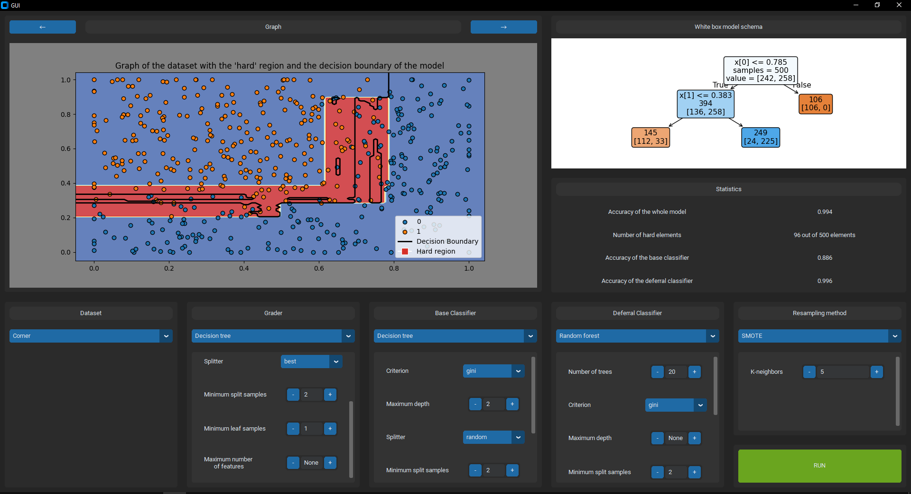

# GUI-White-Black-Box-Models-Mix

This repository contains the code of a GUI developped during a 3-month intership in the Computer Intelligence Laboratory of Osaka Metropolitan University.

It consists in a simple GUI where the user can select differents classifiers and their hyperparameters and run experiments. Results are then displayed in the form of graphs, 
schemas and statistics.


## Project Structure
The main code is located in `src/` which is divided in different categories. For instance, all code files directly related to the graphic interface (frames...) are inside `src/widgets/`. Moreover, tests can be found in `tst/`. Finally, new datasets can be added in `datasets/` (more tweaks are needed though).
```
.
└── GUI/
    ├── datasets/
    ├── src/
    │   ├── datasets/
    │   ├── experiment/
    │   ├── models/
    │   ├── resamplingMethods/
    │   ├── widgets/
    │   └── ...
    ├── tst/
    ├── LICENSE
    ├── READMED.md
    └── requirements.txt
```

## Getting Started


(Warning: the number of features needs to be known when selecting the maximum number of considered features in some models
-> Better to use ratios (float) instead of numbers (int))


## Gallery

