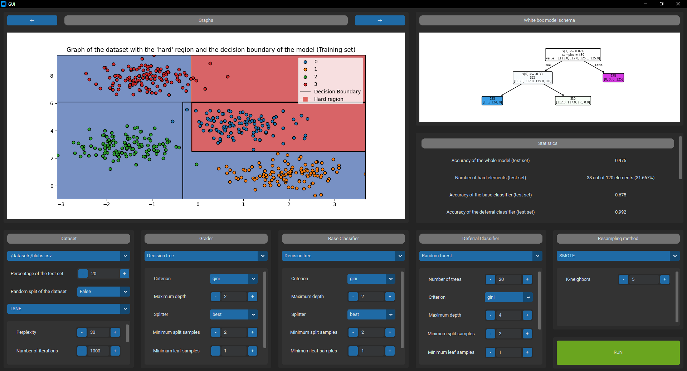
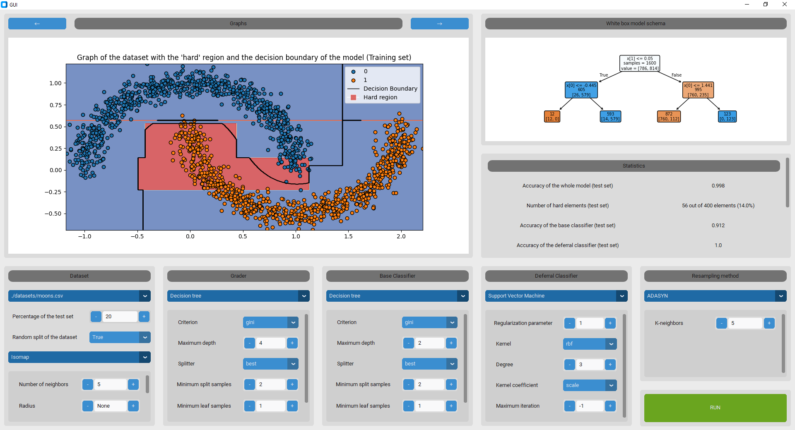
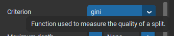

.. _additional:

Additional Features
===================

Light and dark themes
---------------------

The GUI has two themes: dark and light. Currently, the default theme is the same has the operating system. It can be manually changed in the code
in the `./src/main.py` file with the following lines:

    .. code-block:: python

        customtkinter.set_appearance_mode("light")  # light theme
        customtkinter.set_appearance_mode("dark")   # dark theme

For instance, the two themes look like:

Tooltips
--------

Tooltips appear when hovering parameters of the different methods, techiques, classifiers. They provide an explanation of the corresponding parameter.

