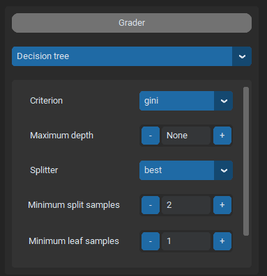

.. _getting_started:

Getting Started
===============

Download
--------

The GUI can be found on GitHub. It is either possible to download the latest version from the 
`release page <https://github.com/UnePatate5010/GUI-White-Black-Box-Models-Mix/releases>`_ or directly from the 
`main branch <https://github.com/UnePatate5010/GUI-White-Black-Box-Models-Mix>`_.

Required packages
-----------------

Before using the GUI, required package must be installed. To do so, the ``requirements.txt`` provides the list of needed packages. Those can
be installed using ``pip`` for example::

    pip install -r ./requirements.txt

To compile the documentation (if needed), some additional packages are needed and can be installed with::

    pip install -r ./requirements_docs.txt

First use
---------

When the GUI has been downloaded and files extracted, it can be launched using::
        
    python3 ./src/main.py

The GUI main window will then open. The following window will be presented:

The window is divided in two parts:

* Input frames at the bottom;
* Output frames at the top.

.. _in:

Input Frames
~~~~~~~~~~~~

Input frames provides different entries that are used to select different parameters. Entries are divided in two categories.
The first one is scrollable menus. Those provides different options and one needs to be selected. The second type of entries is 
spinboxes. Those are composed of one text entry in which numbers can be inputed, and two buttons to increment or decrement the value of the spinbox.
The following images shows examples of input frames:

When all parameters are set, the `RUN` button can be pressed to run an experiment.

Input frames are discussed furthermore in the :doc:`input_frames` section.

.. _out:

Output Frames
~~~~~~~~~~~~~

Output frames offers differens way to visualize results. There are three frames that display respectively graphs, schemas and statistics.
The following screens provides an example of results in the output frames:

Output frames are discussed furthermore in the :doc:`output_frames` section.
