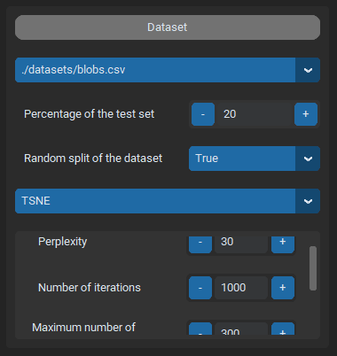
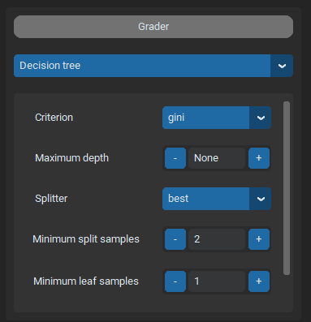
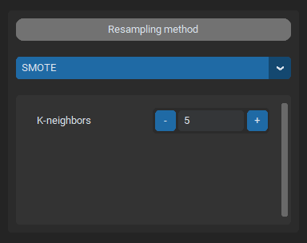

.. _input_frames:

Input Frames
============

Input frames provide different entries to select the components of the method and their hyperparameters. This section focuses
on those frames.

Datasets
--------
This frames allows you to select one of the datasets available in the `datasets` directory. Two entries are used to split the 
dataset into training and test set. The first one is a spinbox that corresponds to the percentage of the dataset that will be used
as test set. By default it is set at 20%. The second entry allows to decide how the dataset is splitted. In one case, it is randomly splitted.
In the other case, the first part of the dataset is used as training set and the last part as test set. For example, if 20% of the dataset was selected
as test set with this option, the 80 first percents of the dataset will be the training set and the remaining 20 the test set.

Different dimensionality reduction techniques can be chosen with an additional scrollable menu. It allows the GUI to reduce the dimension of dataset to 2
for display purposes. If none is selected, graphs will not be displayed if the dataset has too much features.

Grader, Base Classifier and Deferral Classifier
-----------------------------------------------

Each classifier of the ensemble method has its own input frame. However, those frames are identical. They are composed of a scrollable menu to select
the desired classifier and a frame that displays the hyperparameter of the selected classifier.

Data resampling method
----------------------

The data resampling method has its own frame, very similar to classifier frames but smaller. It works the same way though. It is possible to not select
any resampling method.

