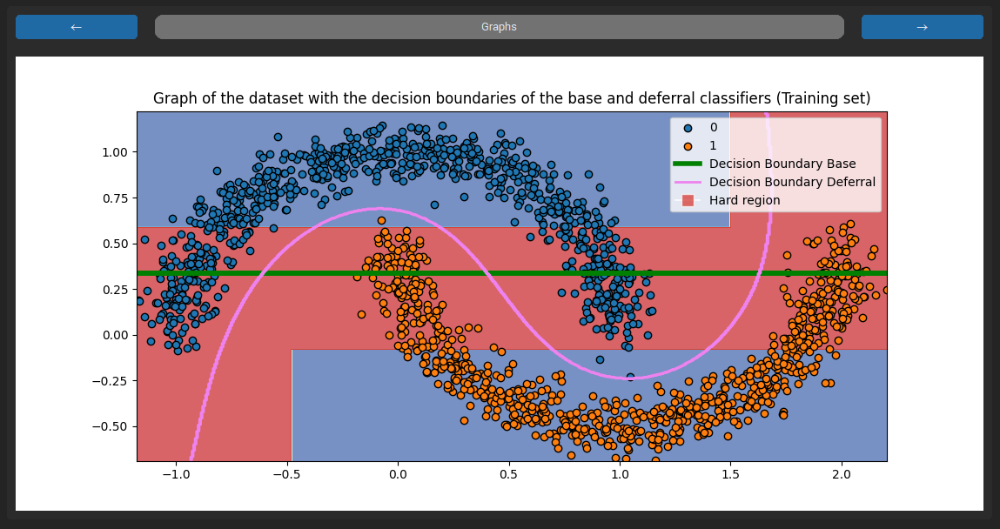
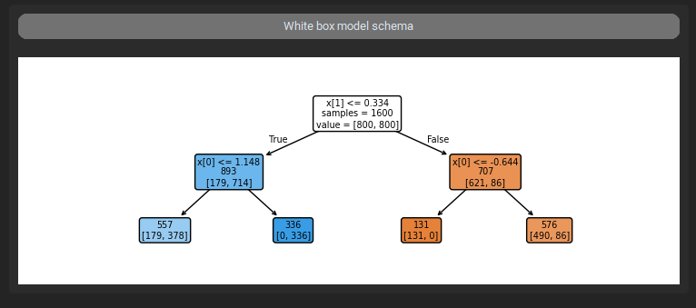
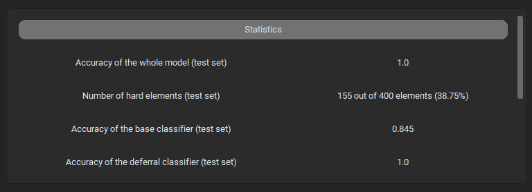

.. _output_frames:

Output Frames
=============

This section gives a small explanation of the different output frames of the GUI.

Graphs
------

The main output frames at the top left is the graphs frames. It displays several graphs in which different decision boudaries and "hard/easy" regions can be observed.
At the top of the frame, two arrow buttons can be used to switch between graphs.

Please note that graphs are only display if the dataset has 2 features or has been reduce to only two features (via a dimensionality reduction technique).

Schemas
-------

The frame at the top right shows a schema of the white box model. It offers a detailed understanding of that classifier.

Currently, only decision tree are supported.

Statistics
----------

The final output frame at the middle right displays a few statistics related to the experiments and the different classifiers.

